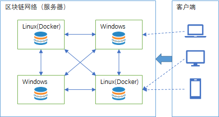
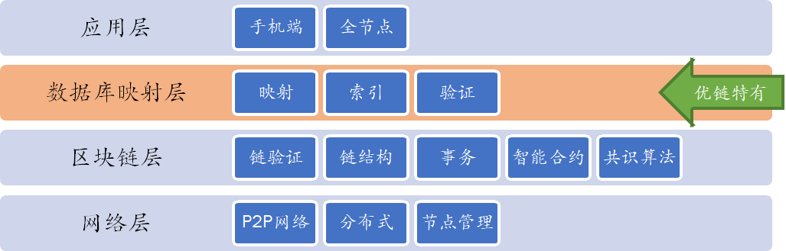
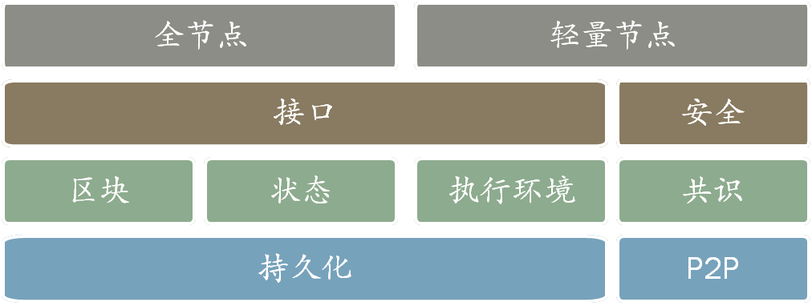
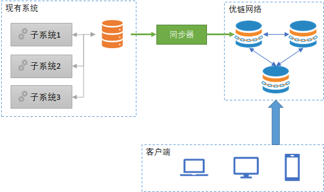

# 入门指引

优链数据库使用区块链技术使得数据库中的数据历史不可更改。

  

在本入门指引中分成服务器部分和客户端部分分别讲述：

- [服务器](#服务器)
- [客户端](#客户端)

优链数据库[影子解决方案](?file=01-简介/5-影子方案 "影子方案")，
是在优链数据库的基础上提供的一种简单易行上链方案：

- 可以不用对现有系统进行内部改造；
- 优链数据库影子方案可以部署至同一台服务器或完全独立的服务器上；
- 所有数据及时上链，更改信息可追溯；
- 可选择公布信息，用户使用客户端查看公开信息；

可至 [案例分析](#案例分析) 部分查看相关案例。

## 服务器

优链数据库使用C#开发，采用.NET Core跨平台框架，支持以下操作系统：

* Windows x64/x86
* Linux x64
* Docker
* Mac（理论支持，尚未测试）

### 安装

我们提供多种安装方式，

- [Windows下安装](?file=02-安装/3-Windows下安装 "Windows下安装")
  对于同时是Windows下的应用，可以使用该方式，或者在使用Windows作为开发平台时的情况。
- [Docker下安装](?file=02-安装/4-Docker下安装 "Docker下安装")
  对于部署到Linux下的应用，或者使用Linux作为开发平台的情况。

### 配置

参见 [配置](?file=02-安装/2-配置 "配置") 部分

### 在线测试服务器

在线演示： http://app.uchaindb.com  
或者扫描二维码在手机端查看：

  

## 客户端

在服务器正常运行后，你需要通过以下客户端库来与服务器通讯。

- [nuget程序包](?file=03-SDK/11-nuget程序包 "nuget程序包")
- [npm程序包](?file=03-SDK/12-npm程序包 "npm程序包")

### 示例程序

您可以直接在以下示例程序的基础上进行修改，以适应您的业务需求：

- [AngularX客户端](?file=07-示例客户端/1-AngularX客户端 "AngularX客户端")

## 案例分析

- [公益数据库](?file=08-案例分析/1-公益数据库 "公益数据库")
# 系统架构

优链数据库拥有一般区块链应用拥有的所有部件，除此之外，额外增加了具备映射、索引、验证功能的数据库映射层。

  

数据库映射层中包含以下功能组件：

* **映射**：将存储在区块链上不可修改的数据库变更记录映射成——类似于传统关系型数据库，可供开发人员直接操作修改的数据库产品；
* **索引**：通过索引技术可以保障数据库中数据查询的效率，避免区块链带来的低效；
* **验证**：使用区块链独有的密码学机制，实时保障数据未被篡改、伪造，以及历史变更记录的正确性和一致性；

## 架构细节



各组件使用的技术栈如下：

> * **全节点**：使用DotNet Core开发，可全平台部署；
> * **轻量节点**：分别提供DotNet Core与JavaScript的源代码，方便集成至任意客户端；

> * **接口**：使用Json RPC的方式调用，为二次开发做好了准备；
> * **安全**：按照[《NIST安全框架》]进行安全考虑

> * **区块**：使用经典的区块链式结构；
> * **状态**：区块链上的状态保存使用Patricia Merkle Trie进行保存，实现数据的快速查找和信息确认；
> * **执行环境**：使用最基础的栈虚拟机，虚拟机支持的命令见[虚拟机指令]()；
> * **共识**：使用标准的PBFT共识算法，在私链、联盟链的环境里高效、安全；

> * **持久化**：系统内部数据以键值对的方式存储，可接入任意支持键值对的数据库（几乎所有传统数据库及NoSql数据库均支持）；
> * **P2P**：服务器之间使用可信名单及其证书签名进行沟通联系，未授权的服务器服务器无法接入P2P网络实现投票；


[《NIST安全框架》]: https://en.wikipedia.org/wiki/NIST_Cybersecurity_Framework
# 文件结构

## 优链客户端代码结构

以下为 [AngularX客户端](?file=04-示例客户端/1-AngularX客户端 "AngularX客户端") 的目录结构

```tree
+---.github                     # 存放github协作相关的文件 
+---cordova                     # 本项目使用Cordova来完成iOS和Android客户端的适配
|   +---hooks                   # Cordova的hook存放目录，暂无文件
|   +---model                   # 原始的客户端图标及启动页面资源文件
|   +---platforms               # 【生成目录】cordova用的平台相关文件
|   +---plugins                 # 【生成目录】cordova用的插件相关文件
|   +---res                     # 【生成目录】生成的客户端图标及启动页面资源文件
|   \---www                     # 【生成目录】从webpack打包后的程序从wwwroot目录拷贝过来的
\---src                         # 客户端源代码目录
    +---ClientApp               # 客户端前端源代码目录
    |   +---app                 # Angular主要源代码存放目录
    |   |   +---components      # 组件存放目录
    |   |   |   +---alarm       # 通知相关代码文件
    |   |   |   +---app         # 主程序相关代码文件
    |   |   |   +---controls    # 通用控件相关代码文件
    |   |   |   +---database    # 链库相关代码文件
    |   |   |   +---navmenu     # 导航相关代码文件
    |   |   |   \---user        # 用户相关代码文件
    |   |   +---directives      # 自定义指令源代码
    |   |   +---models          # 模型定义源代码
    |   |   +---pipe            # 自定义管道源代码
    |   |   \---services        # 系统服务源代码
    |   +---assets              # 其他文件
    |   |   \---locale          # 本地化文件
    |   +---dist                # 【生成目录】服务器渲染所使用的webpack打包后的程序集
    |   \---test                # 测试代码
    +---Controllers             # 驱动客户端的服务器代码
    +---Logs                    # 【生成目录】服务器代码执行中生成的日志文件存放目录
    +---Models                  # 服务器端的模型定义源文件
    +---Properties              # 服务器端的属性文件
    +---Views                   # 服务器端的页面驱动文件
    \---wwwroot                 # 站点文件目录
        +---dist                # 【生成目录】客户端所使用的webpack打包后的程序集
        \---images              # 站点的图片文件
```
# 性能说明

## 性能指标

| 指标         | 单位   | 说明                                   |
| ---          | ---    | ---                                    |
| 链上总事务数 | 个     | 区块链上所有区块的事务总数             |
| 单个事务大小 | 字节   | 单个事务在区块链中所占用的存储空间大小 |
| 连接数       | 个     | 系统同时接受的连接数量                 |
| 系统启动时间 | 秒     | 系统从被执行到可接受请求的时间长度     |
| 事务处理速度 | 个/秒  | 每秒系统可以处理的事务数量             |
| 查询吞吐量   | 次/秒  | 每秒系统可以处理并完成返回的查询数量   |
| 内存占用     | 兆字节 | 系统占用内存的数量                     |

## 测试

### 极限数据量测试

TBD

| 链上总事务数 | 单个事务大小 | 连接数 |     | 系统启动时间 | 事务处理速度 | 查询吞吐量 | 内存占用 |
| ---          | ---          | ---    | --- | ---          | ---          | ---        | ---      |
|              |              |        |     |              |              |            |          |
# 影子方案

优链数据库影子解决方案，是在优链数据库的基础上提供的一种简单易行上链方案：

- 可以不用对现有系统进行内部改造；
- 优链数据库影子方案可以部署至同一台服务器或完全独立的服务器上；
- 所有数据及时上链，更改信息可追溯；
- 可选择公布信息，用户使用客户端查看公开信息；

## 系统架构

  

* 现有系统：已经存在的一套正在运行的系统，数据库可能为多个子系统提供服务；
* 同步器：通过读取数据库中的信息将数据库当时状态的信息同步至优链数据库，进而同步至优链区块链网络；
* 优链网络：由一个或多个优链数据库组成的优链区块链网络；
* 客户端：授权客户在接入指定授权网络后，可以访问优链数据库信息，查看和了解数据及区块信息；

## 架构限制

优链数据库的数据上限及处理速度尚未达到主流非区块链数据库的级别，
参考 [性能说明](?file=01-简介/4-性能说明 "性能说明")，
在选型时注意确认性能要求。

## 后续扩展

可以按照以下步骤逐步将传统数据库转换为区块链数据库。

* 第一步，**使用数据库快照的方式进行**，无须对现有系统进行改造，即可简单快捷的接入优链数据库。
* 第二步，**直接作为关系型数据库使用**，但功能比市面上已有的关系型数据库（如SqlServer或MySql）受到更多的限制，但也可以获得区块链独有的智能合约等功能，故原信息系统需要进行部分改造才能接入。

## 快速上手

### 确保系统的依赖项已经安装

* [.Net core 2.0](https://www.microsoft.com/net/download/Windows/run)： 需要分别安装 `.NET Core Runtime` 和 `ASP.NET Core runtime`.

### 安装及配置优链数据库

请参阅 [入门指引](?file=01-简介/1-入门指引 "入门指引") 完成优链数据库的安装及配置。

### 安装及配置同步器

同步器源代码地址：<https://github.com/uchaindb/DbSynchronizer>

1. 请通过[执行文件发布页面](https://github.com/uchaindb/DbSynchronizer/releases)下载最新的压缩包
1. 确保dotnet core runtime已经安装
1. 将该压缩包解压至任意目录
1. 请参考后面的配置项说明进行配置
1. 通过执行`run.cmd`启动程序
1. 若需停止运行，可以通过`Ctrl+C`终止程序

#### 配置项说明

| 配置项                                                         | 类型       | 默认值 | 描述                                             |
| ---                                                            | ---        | ---    | ---                                              |
| AppSettings:SyncDelayInSeconds                                 | 数字       | 10     | 同步器全自动运行时，两次同步发生的间隔秒数       |
| AppSettings:SyncConfigurationDefault:Chain:Address             | 字符串     | 【空】 | 默认的优链数据库的运行地址                       |
| AppSettings:SyncConfigurationDefault:Chain:PrivateKey          | 字符串     | 【空】 | 默认的用于向优链数据库创建事务的私钥地址         |
| AppSettings:SyncConfigurationDefault:Chain:TableName           | 字符串     | 【空】 | 默认的优链数据库中的目标表名                     |
| AppSettings:SyncConfigurationDefault:Database:ConnectionString | 字符串     | 【空】 | 默认的连接现有数据库的链接字符串                 |
| AppSettings:SyncConfigurationDefault:Database:PkName           | 字符串     | "Id"   | 默认的主键名称                                   |
| AppSettings:SyncConfigurations[i]:Chain:Address                | 字符串     | 【空】 | 该条同步配置的优链数据库的运行地址               |
| AppSettings:SyncConfigurations[i]:Chain:PrivateKey             | 字符串     | 【空】 | 该条同步配置的用于向优链数据库创建事务的私钥地址 |
| AppSettings:SyncConfigurations[i]:Chain:TableName              | 字符串     | 【空】 | 该条同步配置的优链数据库中的目标表名             |
| AppSettings:SyncConfigurations[i]:Database:ConnectionString    | 字符串     | 【空】 | 该条同步配置的连接现有数据库的链接字符串         |
| AppSettings:SyncConfigurations[i]:Database:PkName              | 字符串     | "Id"   | 该条同步配置的主键名称                           |
| AppSettings:SyncConfigurations[i]:Database:SqlSelect           | 字符串数组 | 【空】 | 该条同步配置的数据查询语句                       |

同步器配置文件的样例：（appsettings.json文件中的核心部分）

```json
{
  "SyncDelayInSeconds": "10",
  "SyncConfigurationDefault": {
    "Chain": {
      "Address": "http://localhost:7847/api/rpc",
      "PrivateKey": "5aDSKJxc8KtJBdwtwtefqra34iSrEc8Wjk1csbsT9MNF"
    },
    "Database": {
      "ConnectionString": "Server=(localdb)\\MSSQLLocalDB;Database=Backend;Trusted_Connection=True;MultipleActiveResultSets=true",
      "PkName": "Id"
    }
  },
  "SyncConfigurations": [
    {
      "Chain": {
        "TableName": "捐赠记录"
      },
      "Database": {
        "SqlSelect": [
          "SELECT [Id] ,[Money] as [捐赠金额] ,[ParticipantId] as [捐赠者Id] ,[PostScript] as [附言] ,[ProjectId] as [项目Id] ,[DateCreated] as [时间]",
          "FROM [dbo].[AppDonationRecords]",
          "WHERE Status=1",
          "ORDER BY [DateCreated]"
        ]
      }
    },
    {
      "Chain": {
        "TableName": "项目"
      },
      "Database": {
        "SqlSelect": [
          "SELECT Id, TargetMoney as [目标金额], [Subject] as [项目名称], [Location] as [所在地], [Description] as [项目描述], DateCreated as [时间]",
          "FROM dbo.AppProjects",
          "WHERE [Status]=4 OR ([Status]>=6 AND [Status]<=11)",
          "ORDER BY [DateCreated]"
        ]
      }
    }
  ]
}
```
# 常见问题

## 优链数据库是做什么的？

优链数据库使用区块链技术使得数据库中的数据历史不可更改。

## 为何需要数据历史不可更改？

底层执行人员擅自修改数据库中数据导致非法事件的产生时有发生，为杜绝此类事件发生，最底层的数据库应具备数据历史不可更改的能力。

## 这与现有数据库的历史及审计功能有何区别？

现有数据库的历史及审计功能在权限足够的情况，仍然可以人为修改其历史及审计数据。应用区块链技术后，从根本上解决了历史数据可被修改的可能性。

## 优链数据库如何做到数据历史不可更改？

* 复制。将数据复制到多处不同的地方。
* 内部限制。任意节点均会监控内部数据变化确保没有非法变化产生。
* 外部监控。对具备可读权限的外部系统，可以通过持续的监控数据变化，确保数据变化均是合法和记录下来的，作用类似于审核员。
* 密码学签名。使用密码学签名技术对每一项数据修改历史进行签名，避免非法篡改发生的可能性。
* 强安全性。对于高安全性系统，管理员可通过使用强安全性技术避免数据侵害的可能性。
* 节点多样性。节点多样性可确保系统不会因为一处故障（自然灾害或系统故障）导致系统失效。
# 产品蓝图

这里有关于优链数据库（及相关软件）的未来更新计划，未来计划可能会有变动。

## 长远目标

* 成为基于区块链技术的关系型数据库，在未来可以快速的替代现行的关系型数据库；
* 提高区块链数据库的稳定性及性能，以满足大型企业级应用；
* 实现适合关系型数据库使用的智能合约底层语言Chain-SQL；

## 即将发布的版本

### 0.1.1 （2018-5）

* 实现P2P网络的网络隔离
* 发布nuget程序包

### 0.2 （2018-7）

* 将内存映射数据库存入文件系统，以减少内存占用
* 【云平台】实现多租户环境的接口更新
* 更新查询接口，使其支持更通用的查询

### 0.3 （2018-10）

* 事务、区块更新为二进制流模式

### 更加未来的功能

* Chain-SQL的设计
* 支持主流云平台的快速部署


