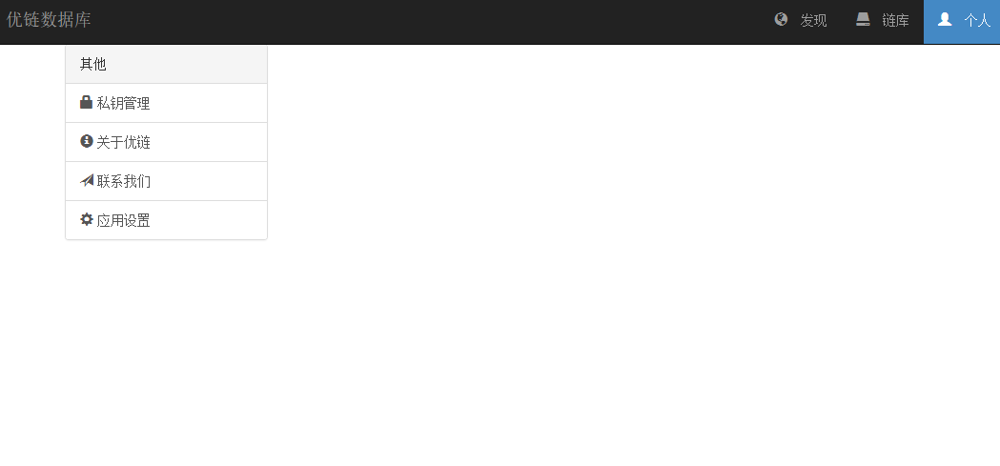
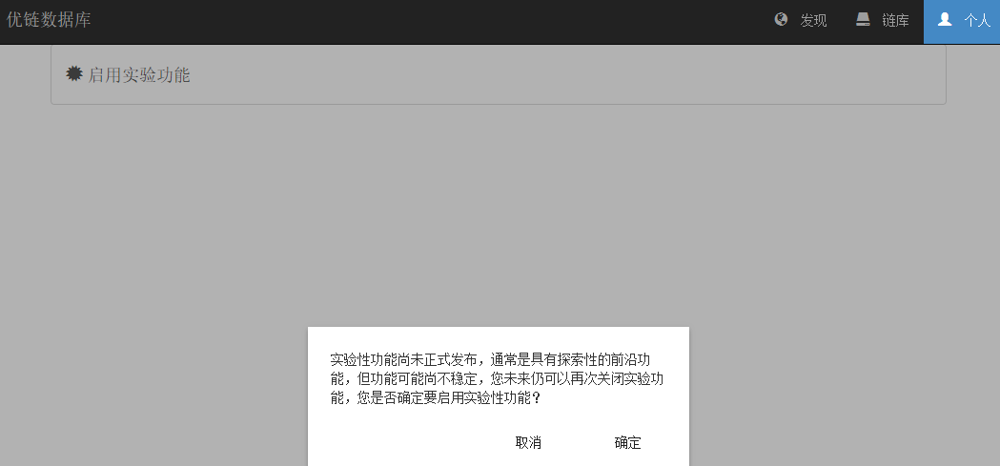
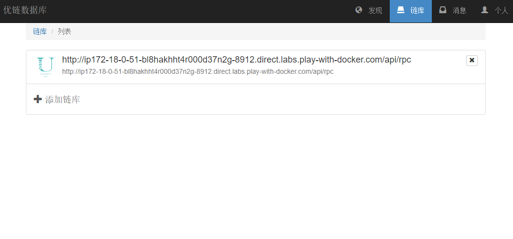
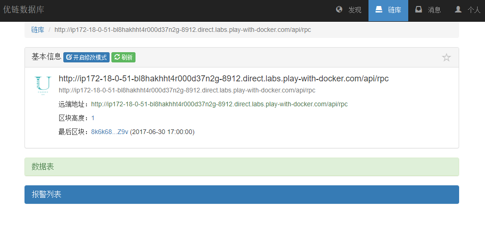

# 更新日志

## 0.1 (v0.1.582.180320)

* 数据库的最基础P2P网络
* [API]操作数据库的Json Rpc接口
* [API]修改数据库结构、数据的接口
* [API]控制数据库权限的接口
* [API]区块链及数据库的查询接口
* 基础版智能合约，用于权限控制
* 密码学签名验证
* PBFT共识算法
* 世界状态存储验证
# 配置

配置可以通过以下几种方式注入到系统中：

* appsettings.json文件
* 环境变量
* ASP.NET的应用程序设置机制

## 配置项说明

| 配置项                                                    | 类型   | 默认值                        | 描述                                     |
| ---                                                       | ---    | ---                           | ---                                      |
| AppSettings:EnableAdminIndex                              | 布尔型 | false                         | 是否在该节点启动管理工具\*               |
| AppSettings:NetworkId                                     | 数字   | 123456789                     | 优链网络Id，不同网络Id互相不进行通信     |
| AppSettings:WellKnownNodeAddresses                        | 字符串 | 【空】                        | 默认启动时的种子服务器地址               |
| AppSettings:Persistent:Adapter                            | 字符串 | "LiteDb"                      | 存储介质选择，可为`LiteDb`或`AzureTable` |
| AppSettings:Persistent:LiteDb:ConnectionString            | 字符串 | "Filename=NodeWeb1.db"        | 使用LiteDb时的链接字符串                 |
| AppSettings:Persistent:AzureTable:StorageConnectionString | 字符串 | "UseDevelopmentStorage=true;" | 连接AzureTable的链接字符串               |
| AppSettings:Persistent:AzureTable:TableName               | 字符串 | "NodeWeb1"                    | AzureTable的表名称                       |

\*: 暂时需要自行部署管理工具在wwwroot目录中

### 样例

注：仅包含appsettings.json文件中的核心部分

```json
{
  "AppSettings": {
    "EnableAdminIndex": false,
    "NetworkId": 123456789,
    "WellKnownNodeAddresses": "http://localhost:7847/api/rpc|http://localhost:7848/api/rpc|http://localhost:7849/api/rpc|http://localhost:7850/api/rpc|http://localhost:7851/api/rpc",
    "Persistent": {
      "Adapter": "LiteDb",
      "LiteDb": {
        "ConnectionString": "Filename=NodeWeb1.db"
      },
      "AzureTable": {
        "StorageConnectionString": "UseDevelopmentStorage=true;",
        "TableName": "NodeWeb1"
      }
    }
  }
}
```
# Windows下安装

> 前置条件:
> * [.Net core 2.0](https://www.microsoft.com/net/download/Windows/run)，其中包含 `.NET Core Runtime` 和 `ASP.NET Core runtime`.

1. 从 <https://github.com/uchaindb/Binary/releases> 下载程序包
1. 将程序包解压至任意目录
1. 对文件appsettings.json进行[配置](?file=02-安装/2-配置 "配置")
1. 执行命令
  ```
  $ dotnet NodeWeb.dll
  ```
1. 打开网页查看是否已经顺利启动。默认地址：<http://localhost:5000/version>

## 升级

1. 下载新的程序包
2. 解压至同一目录

**注意**：请自行备份配置文件

## 卸载

将解压出来的文件删除即可完成卸载。
# Docker下安装

## 准备 Docker 环境

具体步骤可以参考[官网安装步骤(英文)](https://docs.docker.com/install/)
或者 [Docker安装指南(国内中文)](https://yeasy.gitbooks.io/docker_practice/content/install/)，
通过以下命令测试是否成功安装

```
$ docker -v
```

## 运行容器

基于镜像，运行容器

```
$ docker run -it --name demo -p 8912:80 uchaindb/uchaindb:latest
```

## 快速在线Demo

使用Play with Docker的服务，可以快速方便的在网上架设一个临时的demo环境，使用步骤：

* 步骤 1: [单击这里](https://labs.play-with-docker.com/?stack=https://raw.githubusercontent.com/uchaindb/Binary/master/stack.yml) 开始

* 步骤 2: 首次使用时需要登录你的Docker账号. 如果还没有账号，需要在 <https://hub.docker.com> 注册一个

  
  

* 步骤 3: 进入页面后便会开始初始化临时虚拟环境，并下载镜像文件到这个虚拟环境中去。
  这个临时虚拟环境是在云端的，并不会在你的电脑中留下任何东西。
  初始化完成后点击`CLOSE`关闭窗口继续。

  

* 步骤 4: 优链数据库会在后台自动进行初始化，如果想要看到整个过程的日志，输入
  `docker logs -f pwd`**&lt;按tab键自动完成输入&gt;**.

  

* 步骤 5: 点击页面上部的数字 `8912` 以打开刚才启动的优链数据库实例

  
  

这个临时虚拟环境可以最长运行4小时，你可以随时点击 `CLOSE SESSION` 停止和关闭这个虚拟环境，所有的云端资料也会被抹除。

## 简单操作

初始化完成后，你就获得了一个全功能的演示环境

* 步骤 1: 点击 `添加链库` 以进一步连接已启动的实例

  

* 步骤 2: 在这个页面中，点击 `手动添加链库` 按钮

  

* 步骤 3: 在网络地址字段，填入当前地址加上 `/api/rpc`, 例如在图中的实例就是 `http://ip172-18-0-51-bl8hakhht4r000d37n2g-8912.direct.labs.play-with-docker.com/api/rpc`

  

* 步骤 4: 最终你成功的连接上了优链数据库

  
# 启用实验功能

* 步骤 1: 要启用实验功能，点击 `个人` 进入个人面板，并点击 `应用设置`

  

* 步骤 2: 点击 `启用实验功能` 并确认

  

* 步骤 3: 确认后，再回到 `链库` 页面

  

* 步骤 4: 点击任意已经创建的链库，你会发现实验功能已经启用了 

  
