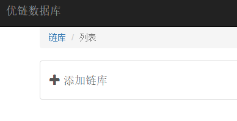
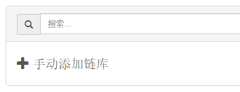
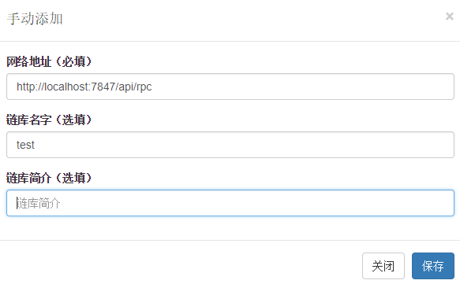
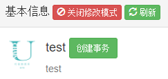
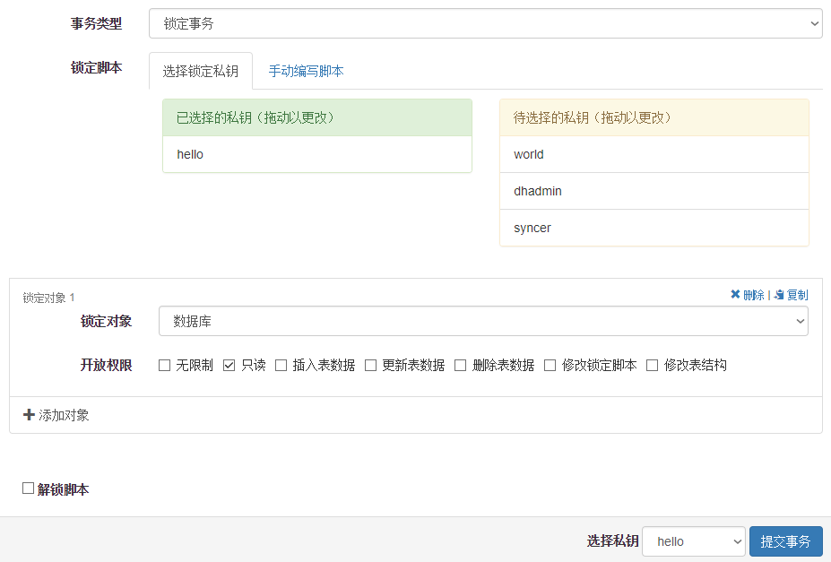
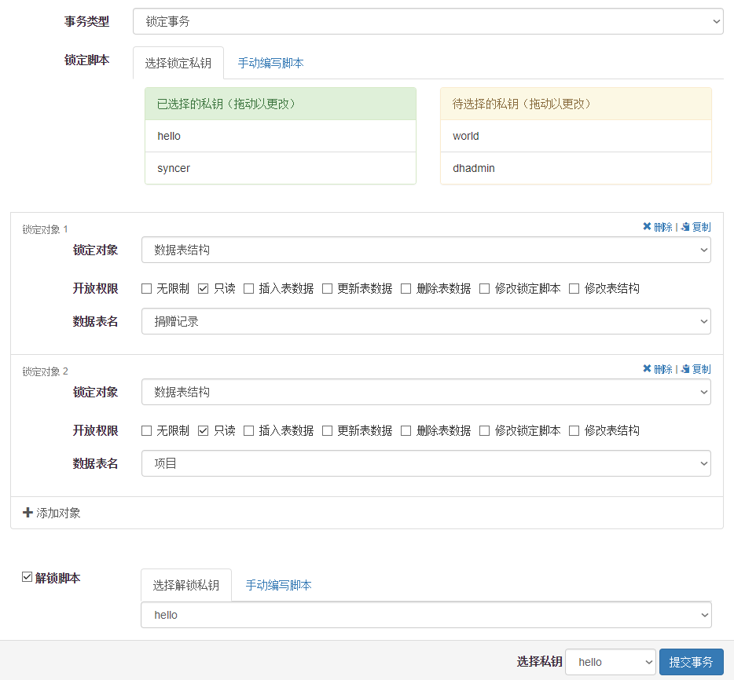

## 使用 {docsify-ignore}

### 创建数据表

#### 打开链库

打开优擎客户端，并进入到链库页面

  

点击`添加链库`按钮

  

进入到链库发现页后，可以直接点击现有的链库添加，或者手动添加，
我们这里需要对我们的测试数据库进行修改测试，所以我们就点击`手动添加链库`

  

在手动添加对话框中填入测试服务器地址信息，并保存。

#### 创建数据表

我们进入到已经添加好的链库中，可以看到默认链库未开启修改模式，点击下面的按钮开启修改模式：
  

开启修改模式后，界面变成如下，出现`创建事务`按钮，可以点击该按钮或者下面提到地方进入创建事务页面。

  

我们打算创建数据表，所以也可以点击`数据表`标题栏的`+`符号。
（此处因为我们准备用预先准备好的脚本，所以从`创建事务`按钮进入并无太大区别。

  

进入创建事务页面后，点击`转到代码模式`按钮，进入到代码模式。

  

粘贴以下代码覆盖现有的代码。

```json
{
  "type": "schema",
  "version": 1,
  "actions": [
    {
      "Type": "CreateSchemaAction",
      "Name": "捐赠记录",
      "Columns": [
        {
          "Type": "String",
          "Name": "Id",
          "PrimaryKey": true
        },
        {
          "Type": "String",
          "Name": "捐赠金额"
        },
        {
          "Type": "String",
          "Name": "捐赠者Id"
        },
        {
          "Type": "String",
          "Name": "附言"
        },
        {
          "Type": "String",
          "Name": "项目Id"
        },
        {
          "Type": "String",
          "Name": "时间"
        }
      ]
    },
    {
      "Type": "CreateSchemaAction",
      "Name": "项目",
      "Columns": [
        {
          "Type": "String",
          "Name": "Id",
          "PrimaryKey": true
        },
        {
          "Type": "Number",
          "Name": "目标金额"
        },
        {
          "Type": "String",
          "Name": "项目名称"
        },
        {
          "Type": "String",
          "Name": "项目描述"
        },
        {
          "Type": "String",
          "Name": "所在地"
        },
        {
          "Type": "String",
          "Name": "时间"
        }
      ]
    }
  ]
}
```

并点击`转至编辑器模式`回到编辑器模式。

  

可以看到如下图的结构。
你可以在此页面进行你所期望的修改，然后选择自己的私钥并提交事务。

  

提交事务后，回到链库首页，可以看到数据表信息如下图，表明新的数据表已经创建成功了。

  

#### 锁定数据表

默认情况，数据库处于可被任意用户修改的状态，需要执行锁定命令来做数据库及数据表的限制。

如下图，我们点击`锁定数据库`按钮

  


进入到事务创建页面，我们将允许进行修改操作的私钥从右侧拖到左侧后。

（若要添加他人公钥，需暂时使用`手动编写脚本`功能）

  

提交事务后，数据库即被锁定，非指定的解锁钥匙，只能做`只读`操作。

接下来我们要进一步对数据表进行锁定修改，目的是让除了超管之外，还有同步器也可以修改该表内容。

与前例类似，我们使用以下代码。

```json
{
  "type": "lock",
  "version": 1,
  "lockScripts": "ybGo1Kn9GYxoumEXmg9mNNXQxCgkgDDkjryzMxoUz5uE\nsWaUUV2536jfaZ4ybo5rP5ZdACu3Q9BoKsVu8SXishtr\n2\nOC_CheckOneOfMultiSignature",
  "targets": [
    {
      "TargetType": "TableSchema",
      "PublicPermission": [
        "ReadOnly"
      ],
      "TableName": "捐赠记录"
    },
    {
      "TargetType": "TableSchema",
      "PublicPermission": [
        "ReadOnly"
      ],
      "TableName": "项目"
    }
  ]
}
```

转换回编辑器模式后，我们执行以下操作：

1. 手动调整锁定私钥，分别将超管和同步器都加进去；
2. 启用解锁脚本，将前面锁定数据库所选择的超管选上；
3. 选择对该事务进行签名的私钥；

配置完成后可以看到如下图：

  

点击提交事务后，即完成数据库的锁定，数据表的创建及权限修改操作。

