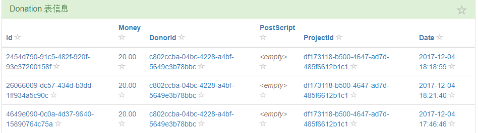
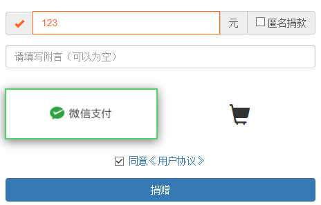
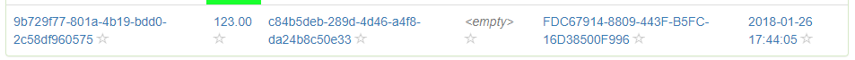
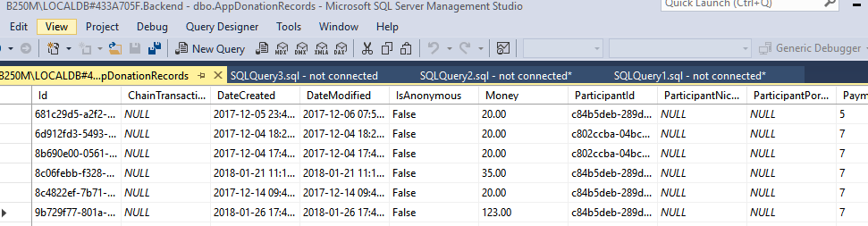
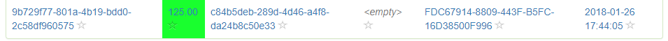
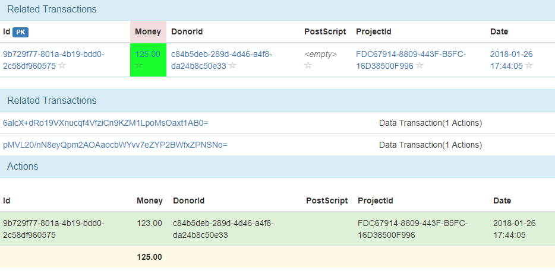

# 案例分析-公益数据库

## 案例展示

### 演示步骤如下

1. 优链数据库核心数据表展示界面
1. 通过向某慈善项目捐款，观察优链客户端中数据变化
1. 模拟DBA直接修改数据库
1. 观察优链客户端中的数据变化及修改历史记录

### 具体演示步骤

首先展示了**优链数据库核心数据表展示界面**
 
  
 
通过向某慈善项目（本地测试版）捐款，**观察优链客户端中数据变化**，为了数据变化更明显，特意选择了比较特殊的数字
 
  
 
捐赠完毕后，转到优链客户端中查看，发现新增一条数据
 
  
 
模拟DBA直接修改数据库：**直接打开数据库，将刚捐的123改成了125**。
 
  
 
再次打开优链客户端，**观察表中的数据变化**（发生过变化的字段被标记为绿色）
 
  
 
点击该链接，**打开修改历史记录查看**：（并可查看该单元格记录修改相关的记录及修改内容）
 
  
 
## 细节分解说明

理解本场景的几个要点

* **分布式优链数据库**，优链数据库基于区块链技术，是专门为数据库信息存储优化设计的区块链，同样支持分布式的全节点及轻量级节点。全节点存储所有数据，可以恢复数据至任意版本或分叉成为新的独立数据库；轻量级节点作为监查节点，可以监听和查阅全节点，存储少量信息即可确认监查对象是否有信息修改操作。
* **独立存储带监控的客户端**，本客户端是独立的客户端，所有数据直接向区块链数据库读取，监控信息存储在本地客户端中，故不存在客户端中信息被他人伪造或截取的可能。
* **并非所有信息都是对公众开放的**，虽然演示示例为对公众公开的捐款数据表，但是优链数据库是支持非公开内部使用的。

