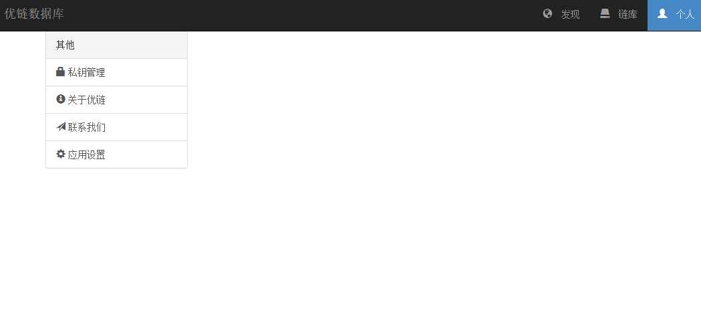
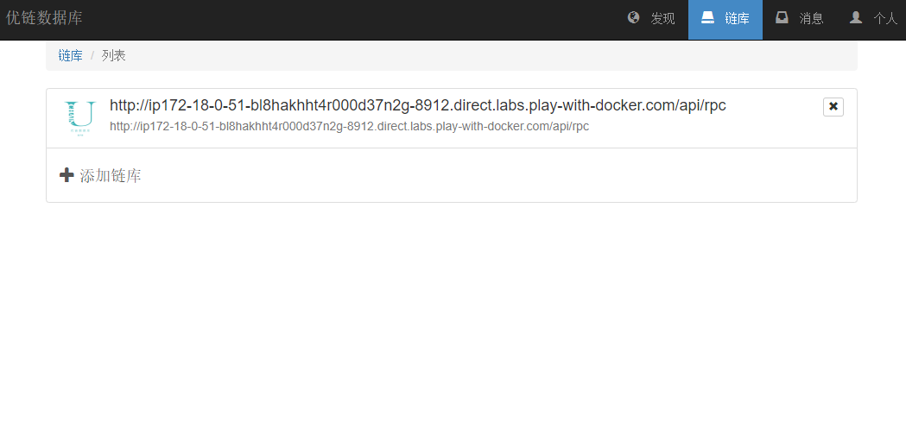
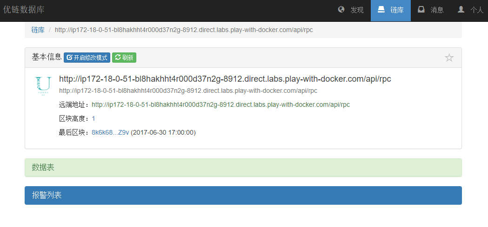

## 配置

配置可以通过以下几种方式注入到系统中：

* appsettings.json文件
* 环境变量
* ASP.NET的应用程序设置机制

### 配置项说明

| 配置项                                                    | 类型   | 默认值                        | 描述                                     |
| ---                                                       | ---    | ---                           | ---                                      |
| AppSettings:EnableAdminIndex                              | 布尔型 | false                         | 是否在该节点启动管理工具\*               |
| AppSettings:NetworkId                                     | 数字   | 123456789                     | 优擎网络Id，不同网络Id互相不进行通信     |
| AppSettings:WellKnownNodeAddresses                        | 字符串 | 【空】                        | 默认启动时的种子服务器地址               |
| AppSettings:Persistent:Adapter                            | 字符串 | "LiteDb"                      | 存储介质选择，可为`LiteDb`或`AzureTable` |
| AppSettings:Persistent:LiteDb:ConnectionString            | 字符串 | "Filename=NodeWeb1.db"        | 使用LiteDb时的链接字符串                 |
| AppSettings:Persistent:AzureTable:StorageConnectionString | 字符串 | "UseDevelopmentStorage=true;" | 连接AzureTable的链接字符串               |
| AppSettings:Persistent:AzureTable:TableName               | 字符串 | "NodeWeb1"                    | AzureTable的表名称                       |

\*: 暂时需要自行部署管理工具在wwwroot目录中

### 样例

注：仅包含appsettings.json文件中主要配置部分

```json
{
  "AppSettings": {
    "EnableAdminIndex": false,
    "NetworkId": 123456789,
    "BlockGenerationTime": 10000,
    "Nodes": [],
    "Name": "DefaultNodeName",
    "PrivateKey": "Ent2iDkLFS5huxVwXUhpDAJR8hKoFQW7iUkxfCkf5tLw",
    "GenesisTime": "2017-6-30 09:00:00Z",
    "PermittedOperations": [ "None" ],
    "LicenseKey": "",
    "BlockPersistent": {
      "Adapter": "Sqlite",
      "Sqlite": {
        "FilePath": "NodeWebBlock1.db"
      }
    },
    "StatePersistent": {
      "Adapter": "Sqlite",
      "Sqlite": {
        "FilePath": "NodeWebState1.db"
      }
    }
  }
}
```

## 启用实验功能

编辑操作属于对高级用户及开发维护人员开放的操作，故需要在客户端里选择启用实验功能后才能启用。

* 步骤 1: 要启用实验功能，点击 `个人` 进入个人面板，并点击 `应用设置`

  

* 步骤 2: 点击 `启用实验功能` 并确认

  

* 步骤 3: 确认后，再回到 `链库` 页面

  

* 步骤 4: 点击任意已经创建的链库，你会发现实验功能已经启用了 

  
